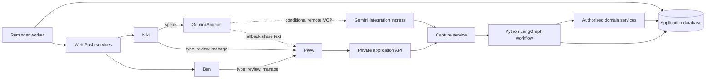
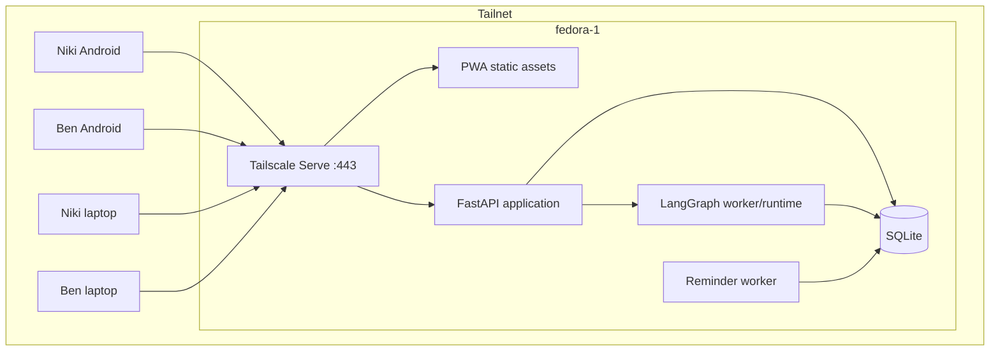
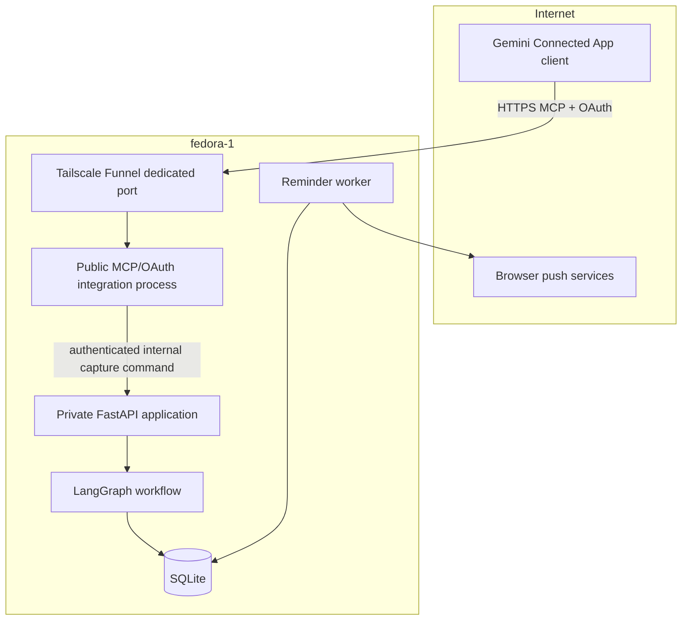
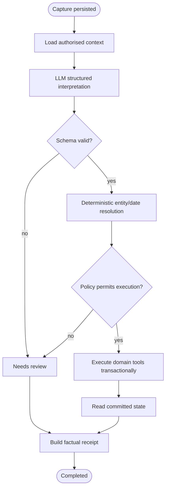
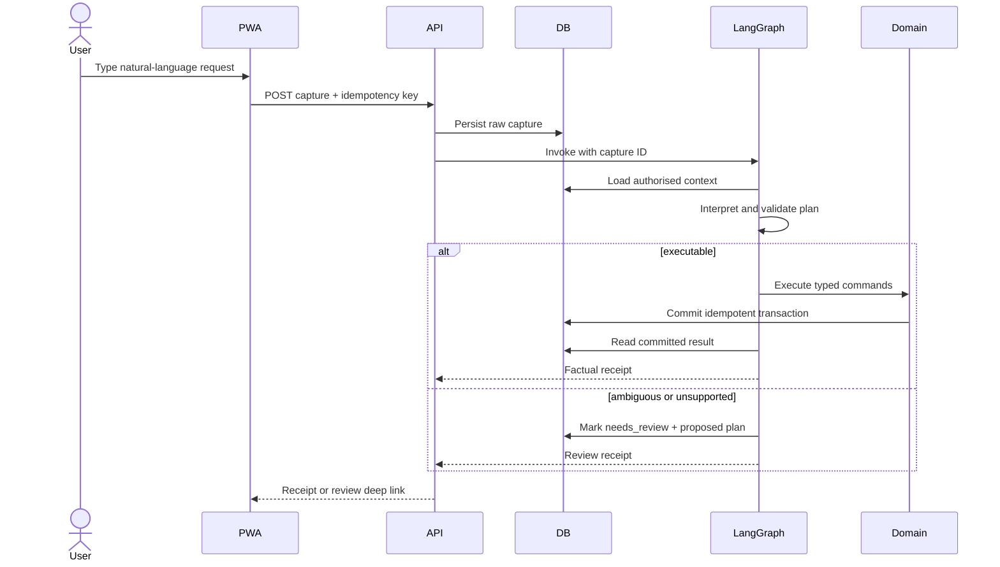
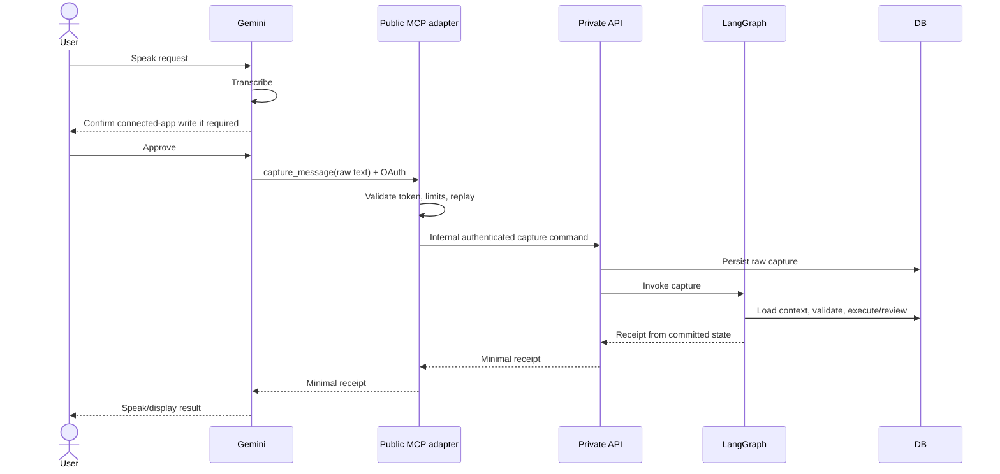
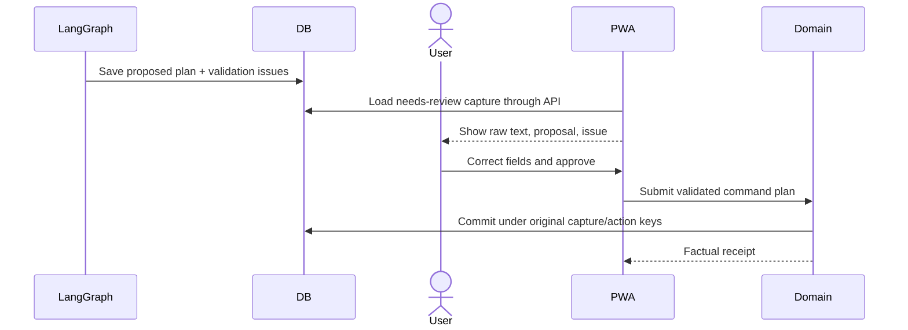

# Architecture

## Status

Proposed architecture for discovery and phased implementation.

This revision replaces the Garmin-first capture path with a channel-independent Python LangGraph command workflow and a conditional Gemini adapter. Phase 1 remains a useful PWA without AI integration.

## Key decision

The domain architecture must not depend on Gemini, Garmin, or any other capture channel.

```text
raw message from any authenticated channel
                  │
                  ▼
        durable Capture record
                  │
                  ▼
       LangGraph command workflow
                  │
       structured, versioned plan
                  │
                  ▼
 deterministic validation + policy
             │             │
          execute       needs review
             │             │
             └──────┬──────┘
                    ▼
            factual receipt
```

Gemini is responsible for voice interaction and transcription. The backend receives raw text and owns intent classification, entity resolution, structure, validation, and execution.

## Architecture goals

The system must:

- provide one responsive PWA for Android phones and laptops;
- support private and shared notes, lists, and reminders;
- deliver reliable reminders to Niki, Ben, or both;
- accept natural-language capture without requiring the user to preselect a content type;
- interpret every natural-language channel through one Python LangGraph workflow;
- retain the original message before model processing;
- constrain model output to versioned command schemas;
- perform writes only through deterministic, authorised application services;
- keep the main application inside the home tailnet;
- expose a public integration listener only when a proven remote client requires it;
- preserve captures and schedules across restarts;
- remain simple enough for a two-user, single-server deployment.

## Constraints and verified platform state

- Both users currently use Android phones.
- `fedora-1` is the always-on application server and Tailscale node.
- The repository is public; secrets, private hostnames, tailnet identifiers, and production credentials must never be committed.
- Gemini can use Connected Apps and some of those apps are available in Gemini Live, but availability varies by app, device, country, and account.[1]
- Google's current custom MCP path is limited to Gemini Spark, requires eligible Spark access, is English-only, and is currently limited to adults in the US using a personal Google Account. A custom app is connected from the Gemini web app and can then be used in Spark on mobile or web.[2]
- Google's custom MCP flow currently requires manual confirmation for write actions.[2]
- Android AppFunctions are an on-device MCP-like integration mechanism, but Gemini integration is still a private preview and requires Android 16 or later.[3]
- Therefore direct Gemini-to-custom-app voice capture is a **feasibility-gated adapter**, not a Phase 1 assumption.
- Garmin Connect IQ and server-side audio transcription are removed from the active MVP architecture.

## System context



The dotted Gemini routes are alternatives selected after the Phase 4 feasibility gate. The PWA and agent path are useful regardless of that outcome.

## Deployment topology

### Baseline: Phases 1–3



### Conditional production Gemini adapter



The public MCP process is not deployed until the real-device feasibility gate passes.

## Network separation

### Private application listener

Tailscale Serve exposes to tailnet devices only:

- PWA assets;
- general API;
- authentication and account management;
- notes, lists, reminders, captures, review, and search;
- push-subscription registration;
- agent execution status and receipts.

### Conditional public integration listener

A separate Tailscale Funnel port and local process expose only:

- MCP protocol discovery/transport required by the selected Gemini client;
- OAuth authorization-server metadata and account linking where required;
- a narrowly scoped capture tool;
- minimal health metadata if needed operationally.

It must not route to the general API, serve the PWA, enumerate users or content, or accept arbitrary resource identifiers without an authenticated user context.

Separate ports, processes, routers, credentials, logs, and tests make accidental exposure harder. If direct Gemini integration is unavailable, this listener does not exist.

## Component responsibilities

### PWA

**Proposed stack:** React, TypeScript, Vite, TanStack Query, and a service worker built explicitly or with Workbox.

Responsibilities:

- responsive phone and desktop interface;
- installable manifest;
- manual notes, lists, reminders, sharing, and search;
- typed natural-language capture;
- capture inbox and **Needs review** UI;
- display proposed plans and validation errors in user language;
- edit and resubmit uncertain captures;
- Web Push permission and subscription registration;
- notification deep-link routing;
- optional Web Share Target receiver for Gemini text fallback;
- small offline queue for direct manual operations where safe.

The PWA does not implement its own classifier. It calls the same capture service as external adapters.

### Private application API

**Proposed stack:** Python, FastAPI, Pydantic, SQLAlchemy 2.x, and Alembic.

Responsibilities:

- application authentication and sessions;
- authorization for owned and shared resources;
- manual CRUD operations;
- capture ingestion;
- transaction boundaries and idempotency;
- agent invocation and status;
- review, correction, approval, and retry endpoints;
- push-subscription registration;
- health and readiness endpoints.

Suggested API prefix: `/api/v1`.

The API persists a capture before agent invocation. For synchronous requests it may then wait for a short agent result; if processing exceeds the response budget, it returns `202 Accepted` with a capture status URL.

### Capture service

A channel-neutral application service used by the PWA, MCP adapter, share target, and future integrations.

Input envelope:

```json
{
  "source": "pwa_text",
  "raw_text": "Add milk and bananas to the shopping list",
  "source_request_id": "opaque-idempotency-key",
  "occurred_at": "2026-09-03T08:15:00+10:00",
  "client_timezone": "Australia/Brisbane"
}
```

The authenticated caller determines the user. The payload cannot nominate an arbitrary owner.

Responsibilities:

1. validate size, encoding, source, and timestamp bounds;
2. enforce idempotency on `(source, authenticated_subject, source_request_id)`;
3. persist raw input and request metadata;
4. enqueue or invoke the LangGraph workflow;
5. return the existing receipt on safe retry.

### LangGraph command workflow

LangGraph is suitable here because it can combine deterministic and model-driven nodes while retaining explicit state, persistence, and human review boundaries.[4] The model remains swappable; LangGraph is the orchestration layer, not the model provider.

Proposed graph:



#### Graph state

```python
class CaptureState(TypedDict):
    capture_id: UUID
    user_id: UUID
    raw_text: str
    reference_time: datetime
    timezone: str
    allowed_people: list[PersonRef]
    candidate_lists: list[ListRef]
    plan: CommandPlan | None
    validation_issues: list[ValidationIssue]
    policy_decision: PolicyDecision | None
    execution_results: list[ActionResult]
    status: CaptureStatus
```

Do not store hidden chain-of-thought. Persist inputs, structured outputs, validation decisions, tool calls, and results.

#### Model boundary

The model receives:

- raw message;
- explicit reference timestamp and timezone;
- authenticated user's display name;
- a minimal list of authorised household members;
- candidate lists with stable opaque IDs and names;
- command schema and policy-relevant instructions.

It does not receive:

- database credentials;
- arbitrary SQL tools;
- unrelated note bodies or reminder histories;
- secrets or push subscription data;
- authority to bypass domain validation.

The agent uses structured output so every proposed plan is validated as a Pydantic discriminated union before it can reach a tool. LangChain agents support schema-constrained structured responses, but application validation remains mandatory.[5]

### Command schemas

Version 1 supports creation only:

```python
class CreateNote(BaseModel):
    type: Literal["create_note"]
    body: str
    share_with_user_ids: list[UUID] = []

class CreateList(BaseModel):
    type: Literal["create_list"]
    title: str
    items: list[str] = []
    share_with_user_ids: list[UUID] = []

class AddListItems(BaseModel):
    type: Literal["add_list_items"]
    list_id: UUID | None
    list_name_as_spoken: str
    items: list[str]

class CreateReminder(BaseModel):
    type: Literal["create_reminder"]
    title: str
    detail: str | None = None
    due_local: datetime | None
    timezone: str
    recipient_user_ids: list[UUID]

class CommandPlanV1(BaseModel):
    schema_version: Literal["1"]
    actions: list[CreateNote | CreateList | AddListItems | CreateReminder]
    ambiguities: list[Ambiguity]
```

Exact Pydantic syntax will be fixed in implementation. The architecture requirement is a versioned discriminated union with bounded action count and string lengths.

### Deterministic resolver and policy gate

The resolver, not the model, makes final decisions about:

- whether a list ID exists and is accessible;
- whether a person is a valid household recipient;
- timezone conversion and date validity;
- duplicate items where product rules define deduplication;
- action-count and payload limits;
- whether all actions can commit atomically;
- whether a request must enter review.

Initial review policy:

| Situation | Result |
| --- | --- |
| Clear private note | Execute |
| Exact authorised list match and non-empty items | Execute |
| New list with explicit title | Execute |
| Reminder with explicit resolvable date/time and recipient | Execute |
| Missing reminder date/time | Needs review |
| Multiple plausible list matches | Needs review |
| Unknown recipient | Needs review |
| Destructive/edit action in a creation-only schema | Needs review as unsupported |
| More than the configured maximum actions | Reject safely |
| Model/schema/validation failure | Needs review |

Google-side Connected App write confirmation is an additional client safety layer, not a substitute for this policy.

### Domain tools

The agent can call small Python functions backed by the same services as manual API routes:

- `create_note(command, actor)`;
- `create_list(command, actor)`;
- `add_list_items(command, actor)`;
- `create_reminder(command, actor)`.

Each tool:

- accepts a validated command, not free-form text;
- receives actor identity from trusted runtime context;
- rechecks authorization;
- is idempotent under the capture/action key;
- writes through a transaction;
- returns typed identifiers and facts from committed state;
- emits an audit event.

No tool accepts SQL, table names, arbitrary URLs, or caller-supplied user identity.

### Gemini MCP adapter — conditional

This adapter exists only if Phase 4 proves it works on Niki's actual account and Android flow.

Responsibilities:

- implement the remote MCP transport expected by Gemini Spark/Connected Apps;
- implement OAuth account linking, including metadata and dynamic client registration if required by the chosen client configuration;
- map OAuth subject to a single application user;
- expose one initial write tool:

```text
capture_message(raw_text: string) -> CaptureReceipt
```

- generate a server-side idempotency key if the client cannot supply one;
- enforce payload limits and per-subject rate limits;
- pass the raw text unchanged to the capture service;
- return only the receipt for that capture.

The MCP tool should not expose separate `create_note`, `add_to_list`, or `create_reminder` operations. Doing so would let Gemini own classification and duplicate business rules that belong in LangGraph.

#### Authentication

Preferred flow:

1. Niki connects the MCP URL in Gemini's custom Connected Apps settings.
2. Gemini initiates OAuth authorization.
3. Niki authenticates to the application through a tailnet-accessible or deliberately bounded linking flow.
4. The authorization server issues a narrow, revocable token for `capture:write`.
5. MCP requests map token subject to Niki; request arguments cannot switch users.

The feasibility spike must prove this flow before the production design is frozen. Google documents Dynamic Client Registration or manually supplied client credentials for custom MCP connections.[2]

#### Public-ingress threat controls

- Dedicated process and port.
- TLS through Funnel.
- OAuth token validation and narrow scopes.
- No bearer tokens in query strings or logs.
- Rate limits per subject and source address.
- Maximum raw-text size and action count.
- Request deadlines and bounded agent concurrency.
- Replay/idempotency handling.
- Generic external errors; detailed internal correlation IDs.
- No read/list/search MCP tools in the initial release.
- Security tests proving general API routes are absent.

### Share-target fallback

If direct custom MCP is unavailable, the installed PWA may register as a Web Share Target:

1. Niki uses Gemini's available share action for the transcript/response.
2. Android offers the installed PWA as a destination.
3. The service worker/application opens `/capture/shared` with prefilled raw text.
4. Niki reviews and submits.
5. The same capture service and LangGraph workflow run.

This adds taps and therefore does not satisfy “direct send,” but it preserves a Gemini transcription path without a native Android app. The real-device spike must verify whether Gemini shares the user transcript, its response, or both in a usable form.

### Reminder worker

A separate Python process using the same domain and persistence packages as the API.

Responsibilities:

- claim due reminders transactionally;
- create deterministic delivery records;
- send Web Push messages;
- retry transient failures with bounded backoff;
- disable expired subscriptions;
- record delivery outcomes;
- recover naturally after restart.

The database remains the scheduling source of truth.

## Primary flows

### PWA natural-language capture



### Conditional Gemini MCP capture



### Needs-review flow



## Data model

Use opaque UUIDs. Mutable records include `created_at`, `updated_at`, and optimistic concurrency metadata where useful.

### Existing product entities

- `users`
- `auth_credentials`
- `devices`
- `push_subscriptions`
- `notes`
- `lists`
- `list_items`
- `reminders`
- `resource_memberships`
- `reminder_recipients`
- `notification_deliveries`

### `captures`

- `id`
- `user_id`
- `source`: pwa_text, gemini_mcp, web_share, future_adapter
- `source_request_id`
- `raw_text`
- `occurred_at`
- `reference_timezone`
- `status`
- `active_execution_id`
- `resulting_resource_summary`
- `safe_error_code`
- timestamps

Unique constraint on `(source, user_id, source_request_id)`.

### `agent_executions`

- `id`
- `capture_id`
- `attempt_number`
- `graph_version`
- `command_schema_version`
- `prompt_version`
- `model_provider`
- `model_name`
- `status`
- `structured_plan_json`
- `validation_issues_json`
- `policy_decision_json`
- `started_at`, `completed_at`
- latency/token/cost metadata where available
- safe error fields

Do not persist hidden model reasoning.

### `agent_action_executions`

- `id`
- `agent_execution_id`
- `action_index`
- `action_type`
- `idempotency_key`
- `validated_command_json`
- `status`
- `result_entity_type`
- `result_entity_id`
- `result_summary_json`
- timestamps

Unique constraint on the idempotency key.

### `integration_identities`

- `id`
- `user_id`
- `provider`: gemini_mcp
- `external_subject_hash` or non-sensitive stable subject identifier
- `scopes`
- `created_at`
- `last_used_at`
- `revoked_at`

### OAuth storage

If the selected MCP connection requires our service to act as an authorization server, store clients, grants, access-token hashes, refresh-token hashes, scopes, expiry, and revocation state in dedicated tables. Never store raw bearer tokens when hash verification is possible.

## API outline

### Private application API

```text
POST   /api/v1/sessions
DELETE /api/v1/sessions/current

POST   /api/v1/captures/text
GET    /api/v1/captures
GET    /api/v1/captures/{capture_id}
POST   /api/v1/captures/{capture_id}/retry
POST   /api/v1/captures/{capture_id}/confirm
POST   /api/v1/captures/{capture_id}/reject

GET    /api/v1/notes
POST   /api/v1/notes
GET    /api/v1/notes/{note_id}
PATCH  /api/v1/notes/{note_id}
DELETE /api/v1/notes/{note_id}

GET    /api/v1/lists
POST   /api/v1/lists
GET    /api/v1/lists/{list_id}
PATCH  /api/v1/lists/{list_id}
POST   /api/v1/lists/{list_id}/items
PATCH  /api/v1/lists/{list_id}/items/{item_id}
DELETE /api/v1/lists/{list_id}/items/{item_id}

GET    /api/v1/reminders
POST   /api/v1/reminders
GET    /api/v1/reminders/{reminder_id}
PATCH  /api/v1/reminders/{reminder_id}
POST   /api/v1/reminders/{reminder_id}/complete
POST   /api/v1/reminders/{reminder_id}/snooze

POST   /api/v1/push-subscriptions
DELETE /api/v1/push-subscriptions/{subscription_id}
```

### Internal adapter API

Bound only to localhost or a private Unix socket:

```text
POST /internal/v1/integration-captures
GET  /internal/v1/integration-captures/{capture_id}/receipt
```

Use service authentication in addition to network locality.

### Conditional public MCP/OAuth surface

Exact paths follow the MCP and OAuth specifications selected during the feasibility spike. Conceptually:

```text
GET/POST /mcp
GET      /.well-known/oauth-authorization-server
GET      /.well-known/oauth-protected-resource
GET/POST /oauth/authorize
POST     /oauth/token
POST     /oauth/register       # only if Dynamic Client Registration is required
```

There is no `/api/v1` route on the public listener.

## Idempotency and transaction semantics

### Capture idempotency

- PWA generates a UUID per submission.
- MCP uses a client-provided request ID if available; otherwise the adapter creates one and retains it for the request lifecycle.
- A repeated source request returns the prior capture and receipt.

### Action idempotency

Derive an immutable action key from capture ID, plan version, and action index. Domain services claim the key before writing. Retrying a graph after an uncertain response reads the existing action result instead of creating a second resource.

### Compound plans

Initial rule: validate all actions before executing any. Prefer one database transaction for same-database writes. If an action cannot participate in the transaction, mark compound external side effects unsupported rather than risk partial success.

## Security and prompt-injection controls

Natural-language input is untrusted. It can contain instructions aimed at the agent or references to resources the user cannot access.

Controls:

- fixed system policy and typed schema;
- minimal authorised context, not broad search results;
- no general web, shell, filesystem, SQL, or arbitrary HTTP tools;
- domain tools recheck authorization and invariants;
- bounded strings, action count, execution time, and retries;
- no secrets in model context;
- no model-generated user IDs accepted without resolver matching;
- unsupported or destructive actions routed to review;
- model output cannot change system prompts, tool definitions, scopes, or policy;
- adversarial evaluation cases included in CI.

## Observability and evaluation

### Operational telemetry

- capture intake count and source;
- status and latency by graph node;
- model/schema/validation failures;
- review rate by action type and reason;
- tool retries and idempotency hits;
- MCP auth/rate-limit failures without raw tokens;
- reminder delivery outcomes.

### Evaluation set

Store versioned, anonymised fixtures with:

- input text;
- fixed reference time/timezone;
- available people and lists;
- expected plan or review reason;
- expected database changes;
- expected receipt facts.

Coverage should include:

- clear notes;
- one and multiple list items;
- new versus existing list;
- relative and absolute reminder dates;
- Niki, Ben, and both recipients;
- compound requests;
- ambiguous list names and dates;
- duplicates and retries;
- unsupported edits/deletes;
- prompt injection and data-exfiltration attempts.

Run deterministic unit tests on resolvers/tools on every change. Run model-backed evaluation before changing prompt, schema, provider, or model in production.

## Failure handling

| Failure | Behaviour |
| --- | --- |
| Model unavailable | Capture remains `received`/`failed_retryable`; manual review and retry available |
| Invalid structured output | Save validation issue; route to review |
| Ambiguous entity/date | Route to review with targeted issue |
| Domain validation failure | Roll back transaction; route to review or terminal failure |
| Timeout after commit | Retry resolves through action idempotency key and returns existing result |
| Gemini retries tool call | Capture/action keys prevent duplicate resources |
| OAuth token revoked/expired | Reject before capture creation |
| Public ingress overloaded | Rate limit/return temporary error; never bypass authentication |
| Reminder push failure | Record and retry independently of agent execution |

## Deployment and persistence

Initial single-host processes:

1. private FastAPI/PWA process;
2. LangGraph execution worker or bounded in-process executor;
3. reminder worker;
4. conditional MCP/OAuth process only after Phase 4 go decision.

SQLite remains acceptable for the initial two-user product if:

- WAL mode and busy timeouts are configured;
- agent and reminder claims use short transactions;
- migrations are managed with Alembic;
- backups are automated and restore-tested;
- model calls never hold database write transactions open.

Move to PostgreSQL only when concurrency or operational evidence justifies it.

## Testing strategy

### Unit tests

- Pydantic command schemas;
- date/timezone resolution;
- list and recipient matching;
- policy decisions;
- domain tool authorization;
- idempotency-key behaviour;
- receipt generation from committed records.

### Integration tests

- API → capture persistence → graph → domain write;
- review correction → original capture → one committed action;
- concurrent duplicate requests;
- transaction rollback for invalid compound plans;
- reminder worker restart and duplicate prevention;
- public listener route allowlist;
- OAuth token scope, expiry, and revocation if MCP is built.

### Model evaluations

- golden command plans;
- expected review decisions;
- expected database diffs;
- adversarial and malformed input;
- regression comparison across prompt/model versions.

### Real-device tests

- installed PWA on both Android phones;
- push permissions and reminder delivery;
- Gemini account eligibility and connected-app visibility;
- voice → raw text → MCP tool → receipt;
- manual write confirmation experience;
- Gemini Live versus Spark availability;
- share-target fallback content and tap count.

## Revised delivery plan

### Phase 1 — Useful PWA (unchanged)

Implement accounts, manual notes, private/shared lists, list items, one-time reminders, responsive UI, migrations/backups, and private Tailscale deployment.

### Phase 2 — Reliable notifications and sharing

Implement Web Push, reminder worker, recipients, retries, delivery history, deep links, and authorization/restart tests.

### Phase 3 — Channel-neutral LangGraph command workflow

Implement captures, execution records, schemas, deterministic resolvers, policy gate, domain tools, PWA text capture, review UI, idempotency, and evaluation fixtures.

### Phase 4 — Gemini feasibility gate

Prove on Niki's actual account and Android phone whether voice can invoke a custom MCP Connected App, with usable authentication, confirmation, latency, raw-text fidelity, and retry behaviour. Do not deploy permanent public ingress before this passes.

### Phase 5A — Production remote MCP adapter

Only after Phase 4 go: build the isolated MCP/OAuth process, Funnel exposure, narrow tool, account mapping, revocation, rate limits, audits, and end-to-end tests.

### Phase 5B — PWA share-target fallback

If no-go: accept Gemini-shared text into the installed PWA and reuse the Phase 3 workflow. Keep monitoring platform support without blocking the product.

### Phase 6 — Refinement

Prioritise safe edits/completions, recurrence, better resolution, offline behaviour, search, and only then optional AppFunctions, Garmin, or other adapters.

## Removed architecture

The following are no longer active MVP components:

- Monkey C Garmin application;
- watch pairing and credentials;
- Tailscale Funnel watch-event ingress;
- watch-triggered push-to-recorder flow;
- browser audio recording and `faster-whisper` transcription;
- separate Note/List/Reminder buttons as a prerequisite for natural-language capture.

Historical Git commits retain the prior design if it needs to be revisited.

## Open architecture decisions

- Initial model provider and privacy/cost budget for LangGraph.
- Exact synchronous versus queued execution threshold.
- Whether reminders with fully explicit fields auto-execute or always enter review.
- Raw capture and agent trace retention periods.
- Whether production MCP OAuth is implemented in-process or through a small vetted authorization component.
- Whether Gemini supplies a stable request identifier; the feasibility spike must measure retry behaviour rather than assume it.
- Whether the share target receives the user's transcript, Gemini's response, or both.
- Whether repository/package names should drop Garmin before code scaffolding.

## Decision record

See [`decisions/0001-gemini-langgraph-capture.md`](decisions/0001-gemini-langgraph-capture.md).

## Sources

[1] https://support.google.com/gemini/answer/13695044?hl=en&co=GENIE.Platform%3DAndroid — Use and manage Connected Apps in Gemini
[2] https://support.google.com/gemini/answer/17209137?hl=en&co=GENIE.Platform%3DDesktop — Connect custom apps for Gemini Spark
[3] https://developer.android.com/ai/appfunctions — Overview of Android AppFunctions
[4] https://docs.langchain.com/oss/python/langgraph/overview — LangGraph overview
[5] https://docs.langchain.com/oss/python/langchain/agents — LangChain agents
