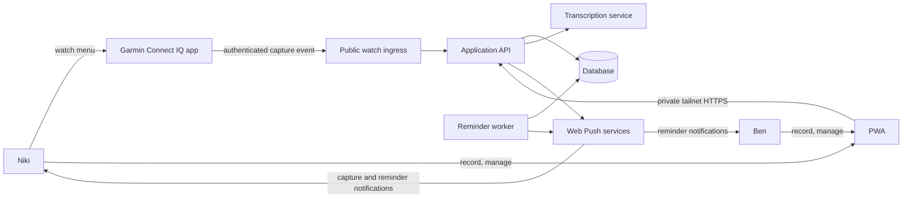
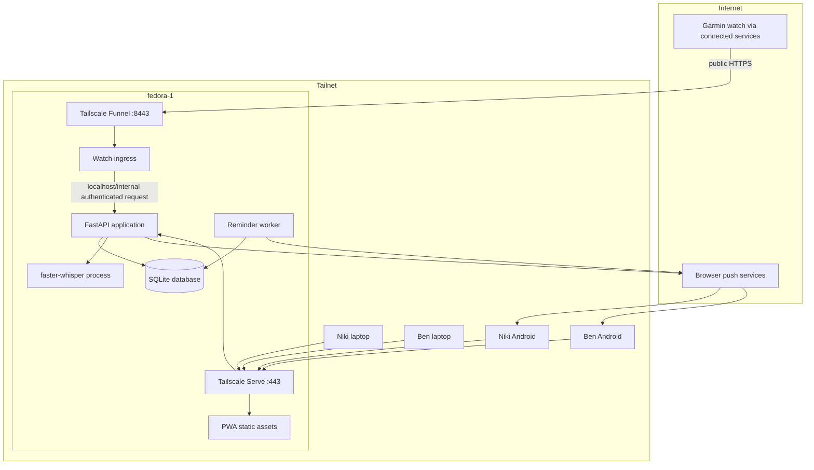
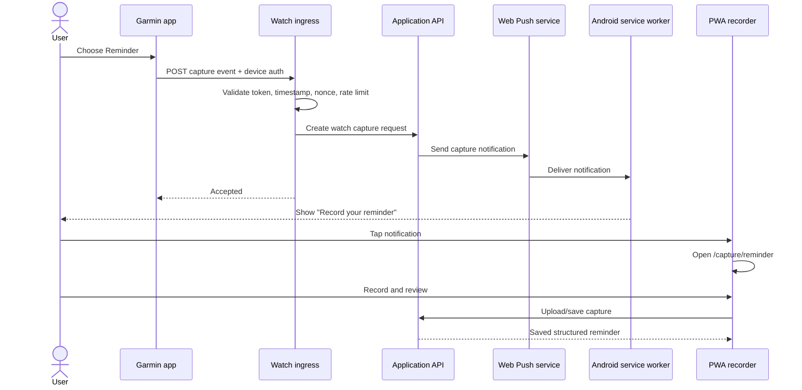
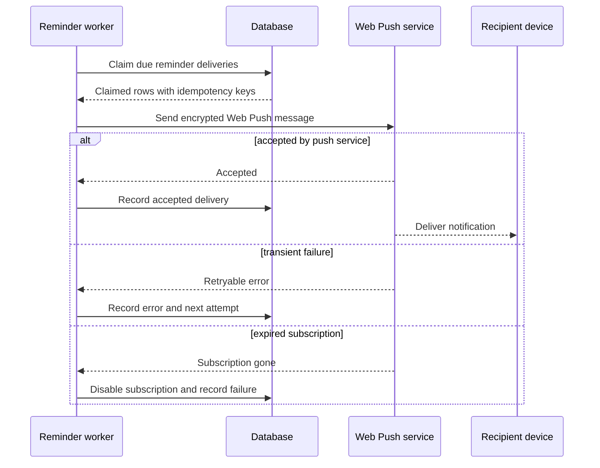
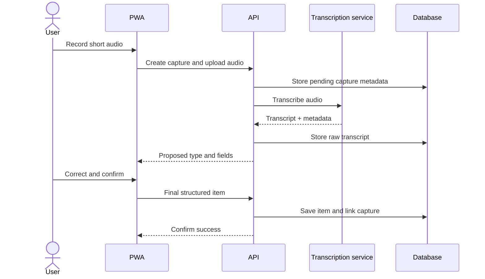

# Architecture

## Status

Proposed architecture for discovery and MVP implementation.

This document records the current design direction. Decisions marked **proposed** must be validated by the Stage 0 feasibility spike or confirmed during implementation.

## Architecture goals

The system must:

- provide one responsive PWA for Android phones and laptops;
- support private and shared notes, lists, and reminders;
- deliver reliable reminders to Niki, Ben, or both;
- let a Garmin watch initiate phone-based capture;
- keep the main application inside the home tailnet;
- expose only a minimal, authenticated surface to the Garmin;
- preserve captures and reminder schedules across restarts;
- remain simple enough for a two-user, single-server deployment.

## Constraints and assumptions

- Both users currently use Android phones.
- The first Garmin target is in the Venu 3 family; the exact variant and Connect IQ API level must be confirmed.
- The selected initial watch workflow is **watch trigger → Android notification → PWA audio recorder**.
- The Garmin does not join the tailnet.
- A PWA cannot use Garmin's native Android Connect IQ Mobile SDK directly.
- `fedora-1` is the always-on application server and Tailscale node.
- The repository is public; secrets, private hostnames, tailnet identifiers, and production credentials must never be committed.

## System context



## Deployment topology



### Network separation

The design deliberately uses two listeners:

1. **Private application listener — Tailscale Serve on 443**
   - PWA assets.
   - General API.
   - Authentication and account management.
   - Notes, lists, reminders, audio, and search.
   - Available only to tailnet devices.

2. **Public watch listener — Tailscale Funnel on 8443**
   - A dedicated ingress process.
   - Only the watch pairing/capture protocol needed by Connect IQ.
   - No general API routing.
   - No ability to read household content.

Tailscale does not allow the same port to be private with Serve and public with Funnel simultaneously. Separate ports and separate local upstreams make the exposure explicit.

## Component responsibilities

### PWA

**Proposed stack:** React, TypeScript, Vite, and a service worker built with a small explicit setup or Workbox.

Responsibilities:

- responsive phone and desktop interface;
- installable web application manifest;
- typed and audio capture;
- transcript review and correction;
- notes, lists, reminders, and search;
- Web Push permission and subscription registration;
- notification deep-link routing;
- small offline queue for unsent captures;
- optimistic list-item updates with server reconciliation.

The browser is not the authoritative reminder scheduler. It may display local state, but all due-reminder decisions come from the backend database and worker.

### Application API

**Proposed stack:** Python, FastAPI, Pydantic, SQLAlchemy 2.x, and Alembic.

Responsibilities:

- application authentication and session handling;
- authorization for owned and shared resources;
- CRUD operations and validation;
- capture ingestion and interpretation orchestration;
- audio upload lifecycle;
- push-subscription registration;
- Garmin pairing and device management;
- transaction boundaries and idempotency;
- health and readiness endpoints.

Suggested API prefix: `/api/v1`.

### Watch ingress

A deliberately small service or narrowly configured FastAPI sub-application bound to a separate local port.

Responsibilities:

- terminate only behind Tailscale Funnel;
- validate watch credentials;
- enforce request timestamp and nonce/replay rules;
- rate-limit per credential and source;
- validate a small fixed schema;
- submit a capture-trigger command to the private application API;
- return minimal success/failure information.

It must not:

- expose general user authentication;
- return notes, lists, reminders, users, or push subscriptions;
- accept audio;
- share the main API router by accident;
- trust a user identifier supplied without a valid device credential.

### Reminder worker

A separate Python process using the same domain and persistence packages as the API.

Responsibilities:

- query due reminders from the database;
- create deterministic delivery records;
- send Web Push messages;
- retry transient failures with bounded backoff;
- disable expired subscriptions when push services report them as gone;
- update delivery status;
- recover naturally after restart.

The database is the scheduling source of truth. The worker should poll and claim due work transactionally rather than relying solely on in-memory timers.

### Transcription service

Initial implementation: a local `faster-whisper` process or module on `fedora-1`.

Responsibilities:

- accept short audio captured by the PWA;
- normalise supported browser audio formats;
- produce transcript text and confidence metadata where available;
- enforce upload size and duration limits;
- delete confirmed audio according to the retention policy.

The transcription boundary should be represented by a Python interface so a hosted implementation can be substituted later without changing capture-domain logic.

### Garmin Connect IQ app

**Language:** Monkey C.

Responsibilities:

- present fast Note, List, Reminder, and Quick capture actions;
- pair with a user through a short-lived code or authorization flow;
- store a revocable device credential in application storage;
- send small authenticated HTTPS events using `Toybox.Communications.makeWebRequest`;
- display queued, successful, and failed states;
- avoid presenting a successful state until the backend acknowledges the event.

The MVP does not assume access to watch microphone audio from Monkey C.

## Primary flows

### Garmin-triggered phone capture



### Due reminder delivery



### Voice capture processing



## Data model

The model should use opaque UUIDs or equivalent non-sequential public identifiers. All mutable records include `created_at`, `updated_at`, and a version or equivalent concurrency strategy where useful.

### `users`

- `id`
- `display_name`
- `timezone`
- `status`

### `auth_credentials`

Application-level credentials or passkeys, separate from Garmin device credentials.

- `id`
- `user_id`
- `credential_type`
- credential-specific public data
- `created_at`
- `revoked_at`

### `devices`

- `id`
- `user_id`
- `kind`: browser, android_pwa, garmin
- `display_name`
- `last_seen_at`
- `revoked_at`

### `watch_credentials`

- `id`
- `device_id`
- hashed token or public-key material
- `created_at`
- `expires_at` where applicable
- `revoked_at`
- `last_nonce` or replay-control metadata

Raw watch secrets are never stored in plaintext if token verification can use a secure hash.

### `push_subscriptions`

- `id`
- `device_id`
- endpoint
- Web Push key material
- `created_at`
- `last_success_at`
- `disabled_at`
- failure metadata

Endpoint and key material are sensitive application data and must not be logged.

### `captures`

- `id`
- `user_id`
- `source`: watch, phone, desktop
- `requested_kind`: note, list, reminder, quick
- `input_mode`: text, audio, watch_trigger
- `raw_text`
- `audio_object_key` or local reference
- `status`: pending, transcribing, needs_review, completed, failed
- interpretation metadata
- resulting entity type and identifier
- error summary safe for display

### `notes`

- `id`
- `owner_user_id`
- `body`
- `archived_at`

### `lists`

- `id`
- `owner_user_id`
- `title`
- `archived_at`

### `list_items`

- `id`
- `list_id`
- `body`
- `position`
- `created_by_user_id`
- `completed_at`
- `completed_by_user_id`

### `reminders`

- `id`
- `creator_user_id`
- `title`
- `detail`
- `due_at_utc`
- `source_timezone`
- recurrence rule, deferred initially
- `status`
- `completed_at`
- `cancelled_at`

### `resource_memberships`

A generic or explicit mapping granting a user access to a note or list. Reminder recipients are modelled separately because notification state is part of the relationship.

- `id`
- resource type and identifier
- `user_id`
- `permission`: view or edit

### `reminder_recipients`

- `reminder_id`
- `user_id`
- `notification_status`
- acknowledgement/completion metadata if later required

### `notification_deliveries`

- `id`
- notification type
- related entity identifier
- recipient user and device/subscription
- deterministic idempotency key
- attempt count
- status
- next attempt time
- provider response category
- timestamps

## API outline

This is a boundary sketch, not a frozen contract.

### Private application API

```text
POST   /api/v1/sessions
DELETE /api/v1/sessions/current

POST   /api/v1/captures/text
POST   /api/v1/captures/audio
GET    /api/v1/captures
GET    /api/v1/captures/{capture_id}
POST   /api/v1/captures/{capture_id}/confirm

GET    /api/v1/notes
POST   /api/v1/notes
GET    /api/v1/notes/{note_id}
PATCH  /api/v1/notes/{note_id}
DELETE /api/v1/notes/{note_id}

GET    /api/v1/lists
POST   /api/v1/lists
GET    /api/v1/lists/{list_id}
PATCH  /api/v1/lists/{list_id}
POST   /api/v1/lists/{list_id}/items
PATCH  /api/v1/lists/{list_id}/items/{item_id}
DELETE /api/v1/lists/{list_id}/items/{item_id}

GET    /api/v1/reminders
POST   /api/v1/reminders
GET    /api/v1/reminders/{reminder_id}
PATCH  /api/v1/reminders/{reminder_id}
POST   /api/v1/reminders/{reminder_id}/complete
POST   /api/v1/reminders/{reminder_id}/snooze

POST   /api/v1/push-subscriptions
DELETE /api/v1/push-subscriptions/{subscription_id}

POST   /api/v1/watch-pairings
GET    /api/v1/watch-pairings/{pairing_id}
DELETE /api/v1/devices/{device_id}
```

### Public watch API

```text
POST /watch/v1/pairings/claim
POST /watch/v1/capture-events
```

Pairing details remain a design item. The preferred pattern is a short-lived, single-use code initiated from the authenticated PWA, followed by issuing a device-specific credential.

Example capture-event body:

```json
{
  "event_id": "opaque-client-generated-id",
  "kind": "reminder",
  "occurred_at": "2026-09-02T06:00:00Z",
  "nonce": "unique-random-value"
}
```

The authenticated device determines the user. The request body does not choose an arbitrary user or recipient.

## Authentication and authorization

### Application users

Tailscale network membership controls network reachability but may not reliably distinguish Niki and Ben, particularly if devices share a Tailscale account. The application therefore needs its own user identity.

**Proposed initial approach:** device-bound passkeys where browser support and deployment HTTPS permit them, with a small recovery mechanism documented for the household. A simpler authenticated pairing code may be used during the first internal prototype, but permanent shared passwords should be avoided.

Authorization rules:

- owners can manage their resources and sharing;
- shared members receive only the permission granted;
- reminder recipients can read reminders addressed to them;
- only the creator or an explicitly permitted recipient can modify reminder state, according to product rules;
- all resource queries enforce authorization in the database/domain layer, not only in the UI.

### Garmin device authentication

A watch receives a device-specific credential after pairing. Proposed request protection:

- TLS through Funnel;
- device token in an authorization header;
- server stores a secure token hash;
- event identifier for idempotency;
- bounded timestamp skew;
- nonce/replay tracking;
- per-device rate limits;
- immediate credential revocation from the PWA.

If Connect IQ storage or crypto APIs make this design unsuitable on the target device, the feasibility spike must revise the protocol before production implementation.

## Notification architecture

### Capture notifications

A valid watch event causes the API to create a short-lived capture request and enqueue a push notification to the paired user's active Android subscriptions.

The notification deep link contains an opaque capture identifier and requested kind, for example:

```text
/capture/reminder?request=<opaque-id>
```

### Reminder notifications

For each reminder recipient, the worker resolves active push subscriptions and creates one delivery per subscription. A deterministic idempotency key prevents duplicate sends for the same reminder occurrence and subscription.

Suggested key shape:

```text
reminder:{reminder_id}:occurrence:{due_at_utc}:subscription:{subscription_id}
```

### Privacy

Notification payloads should default to minimal lock-screen content, such as:

- `Reminder due`
- `Open the app to view`

A user preference may later allow reminder titles on the lock screen.

## Reminder scheduling

The MVP supports one-time reminders. Recurrence should be added only after one-time delivery is proven reliable.

Polling design:

1. Worker wakes at a short interval.
2. It finds due, pending reminder-recipient occurrences.
3. It transactionally creates or claims delivery rows.
4. It sends pushes outside long-held database transactions.
5. It records accepted, retryable, or permanent outcomes.
6. Retryable rows receive bounded exponential backoff.

On restart, pending database rows are naturally rediscovered. No reminder depends on a process-local timer surviving.

SQLite supports the initial workload, but writes must be short, indexed, and designed to avoid unnecessary contention between the API and worker. WAL mode and a busy timeout should be configured explicitly.

## Capture and interpretation pipeline

The first implementation should be conservative:

1. Preserve the raw text or transcript.
2. Detect the requested or likely item kind.
3. Extract candidate fields.
4. Assign interpretation confidence or warnings.
5. Always ask for confirmation when a reminder time or recipient was inferred.
6. Keep failures in the capture inbox.

Natural-language date parsing should be isolated behind an interface and covered with timezone-focused tests. A rules-based parser is preferable for the first version. An LLM may later propose structure, but it must not be the durable source of truth and must not silently schedule uncertain reminders.

## Offline and synchronisation strategy

MVP offline support is intentionally narrow:

- cache the application shell;
- keep the latest read state where practical;
- queue newly typed captures while offline;
- clearly mark pending synchronisation;
- do not claim a reminder is scheduled until the backend confirms it;
- resolve list edits using server versions or timestamps rather than silently overwriting newer state.

Full multi-device conflict-free collaborative editing is out of scope.

## Storage and backup

### Database

Initial database: SQLite with:

- WAL mode;
- foreign keys enabled;
- explicit migrations;
- busy timeout;
- regular integrity checks;
- restricted filesystem permissions.

### Audio

Short capture audio may be stored in a private local directory outside the PWA static root. The database stores metadata and a generated object key, never a user-supplied path.

Default proposed lifecycle:

1. Upload with strict duration and size limits.
2. Transcribe.
3. Retain until the user confirms or discards the capture.
4. Delete after confirmation unless a later product decision enables retention.

### Backups

- periodic SQLite online backup to a protected local backup directory;
- rotation with a small documented retention policy;
- optional encrypted replication to another tailnet device later;
- automated restore test, not only backup-file creation.

## Observability

### Structured logs

Log:

- request and correlation identifiers;
- event type and safe entity identifiers;
- reminder delivery status categories;
- watch authentication failures without credentials;
- transcription duration and outcome;
- worker cycle and backlog counts.

Never log:

- bearer tokens;
- push subscription keys or full endpoints;
- raw audio;
- full note/reminder content by default;
- authentication secrets.

### Metrics / health

Initial health surfaces:

- API liveness and readiness;
- database connectivity;
- worker last-successful-cycle timestamp;
- due-delivery backlog;
- push success/failure counts;
- transcription duration/error counts;
- watch event accepted/rejected counts.

A simple internal status page or Prometheus-format endpoint is sufficient; a full observability stack is not required for MVP.

## Security boundaries and threats

| Threat | Primary mitigation |
| --- | --- |
| Public endpoint enumerates household data | Separate ingress with write-only event contract and no general API routes |
| Stolen/replayed watch request | Per-device credentials, timestamps, nonces, idempotent event IDs, revocation |
| Compromised browser subscription | Device-level revocation and minimal lock-screen payloads |
| User accesses another user's private resource | Server-side object authorization on every query/mutation |
| Duplicate reminder after retry/restart | Deterministic delivery idempotency keys and durable delivery rows |
| Malicious or oversized audio upload | Authentication, content/type validation, duration/size limits, transcoding isolation |
| Secret committed to public repository | Environment-backed secrets, example files only, secret scanning in CI |
| Funnel accidentally exposes the main API | Separate port, process, router, and deployment test from outside the tailnet |
| Reminder date interpreted incorrectly | Explicit review of inferred date, timezone, recurrence, and recipients |

## Repository shape

Proposed monorepo structure:

```text
.
├── apps/
│   ├── api/                 # FastAPI entry point and HTTP routers
│   ├── web/                 # React/TypeScript PWA
│   ├── watch-ingress/       # Narrow public ingress process
│   ├── reminder-worker/     # Durable notification worker entry point
│   └── garmin/              # Monkey C Connect IQ application
├── packages/
│   └── backend/             # Shared Python domain, persistence, push, transcription
├── migrations/              # Alembic migrations
├── deploy/                  # Non-secret deployment and service definitions
├── docs/
│   ├── product-brief.md
│   └── architecture.md
├── tests/
│   ├── integration/
│   └── e2e/
└── README.md
```

An alternative is placing Python packages under `src/`; the exact Python layout should be decided when scaffolding. The architectural requirement is that API, ingress, and worker entry points share tested domain code without sharing public routes.

## Testing strategy

### Backend unit tests

- ownership and sharing rules;
- reminder due-date and timezone handling;
- idempotency key generation;
- retry classification;
- capture state transitions;
- watch request timestamp and nonce validation;
- conservative interpretation behaviour.

### API integration tests

- private-resource isolation;
- shared list collaboration;
- reminder recipient permissions;
- audio validation;
- watch ingress cannot access general resources;
- push subscription lifecycle;
- restart/recovery behaviour against a real SQLite database.

### PWA tests

- component tests for capture review and reminder confirmation;
- service-worker push handling;
- notification deep links;
- offline capture queue;
- responsive phone and desktop flows;
- Playwright end-to-end scenarios.

### Garmin tests

- Monkey C unit tests where supported;
- Connect IQ simulator communication tests;
- target-device pairing and event tests;
- disconnected-phone and timeout behaviour;
- duplicate button press/idempotency behaviour.

### Deployment tests

From inside the tailnet:

- PWA and private API are reachable over Serve.

From outside the tailnet:

- PWA and private API are not reachable.
- only the intended watch ingress port and routes are reachable.
- unsupported paths and methods fail closed.

## Delivery and operations

Initial deployment should use systemd services or containers with equivalent restart and health behaviour. The decision can be made during scaffolding based on the repository's development experience.

Required long-running processes:

- PWA/static server or API-served static build;
- FastAPI application;
- watch ingress;
- reminder worker;
- transcription process if separated.

Deployment must include:

- environment-backed secrets;
- database and audio directories mounted persistently;
- migrations before application promotion;
- service restart policy;
- Tailscale Serve and Funnel configuration documentation;
- backup and restore commands;
- rollback procedure.

## Architectural decisions

### ADR-001: PWA before native Android

**Status:** Proposed.

Use an installable PWA for phone and desktop. Build a native Android companion only if the watch HTTPS path or PWA notification flow proves insufficient.

**Reason:** One codebase meets current phone and laptop needs and avoids an unnecessary native release pipeline.

### ADR-002: Watch initiates, phone records

**Status:** Selected for MVP.

The Connect IQ app triggers a notification; audio is captured in the Android PWA.

**Reason:** This preserves rapid wrist initiation without depending on unconfirmed Monkey C microphone access.

### ADR-003: Private main app plus narrow public ingress

**Status:** Proposed; validate in Stage 0.

Use Tailscale Serve for the private app and a separate Tailscale Funnel listener for watch events.

**Reason:** The watch cannot join the tailnet, while household content should not be publicly exposed.

### ADR-004: SQLite first

**Status:** Proposed.

Use SQLite in WAL mode with Alembic migrations and durable worker tables.

**Reason:** The two-user, single-host workload does not justify PostgreSQL operational overhead. Persistence interfaces and migrations should keep later migration possible.

### ADR-005: Database-backed reminder scheduling

**Status:** Selected.

Use a polling worker and durable delivery rows rather than in-memory-only timers.

**Reason:** Reminders must survive restarts and avoid duplicate sends.

### ADR-006: Conservative interpretation

**Status:** Selected.

Preserve raw captures and require confirmation of inferred reminder times and recipients.

**Reason:** A missed clarification is less harmful than silently notifying the wrong person at the wrong time.

## Stage 0 feasibility spike acceptance criteria

The architecture is viable when a throwaway vertical slice proves all of the following on real devices:

1. The target Garmin Connect IQ app can issue the required authenticated HTTPS request.
2. The Funnel listener receives only the expected watch request.
3. A duplicate watch event is processed once.
4. The backend sends Web Push to Niki's Android PWA subscription.
5. The notification arrives while the PWA is closed or not focused.
6. Tapping it opens the correct capture route.
7. The main PWA/API remains unreachable outside the tailnet.
8. A revoked watch credential is rejected.
9. Median and worst observed trigger-to-notification latency are recorded.
10. Failures on disconnected phone/watch paths are understandable to the user.

If items 1–6 fail for platform reasons, revisit a minimal native Android companion using Garmin's Connect IQ Mobile SDK before building the full Garmin integration.

## Open architecture questions

- Exact Garmin model, firmware, and supported Connect IQ API level.
- Whether `makeWebRequest` reaches the Funnel endpoint reliably in all expected connectivity modes.
- Best application authentication method for Niki and Ben: passkeys, device pairing, or another low-friction private approach.
- Whether `fedora-1` can transcribe short recordings locally within an acceptable latency target.
- Browser audio format emitted by the chosen Android browsers and the required transcoding path.
- Whether SQLite contention remains negligible with API, worker, and transcription metadata writes.
- Lock-screen notification privacy preference.
- Final audio retention policy.
- Whether the watch requires acknowledgement only for server receipt or also for successful phone push acceptance.

## References

- [Garmin Connect IQ `Toybox.Communications`](https://developer.garmin.com/connect-iq/api-docs/Toybox/Communications.html)
- [Garmin Connect IQ `WatchUi.TextPicker`](https://developer.garmin.com/connect-iq/api-docs/Toybox/WatchUi/TextPicker.html)
- [Garmin: Communicating with Mobile Apps](https://developer.garmin.com/connect-iq/core-topics/communicating-with-mobile-apps/)
- [MDN Push API](https://developer.mozilla.org/en-US/docs/Web/API/Push_API)
- [Tailscale Funnel](https://tailscale.com/kb/1223/funnel)
- [Tailscale Serve](https://tailscale.com/kb/1242/tailscale-serve)
